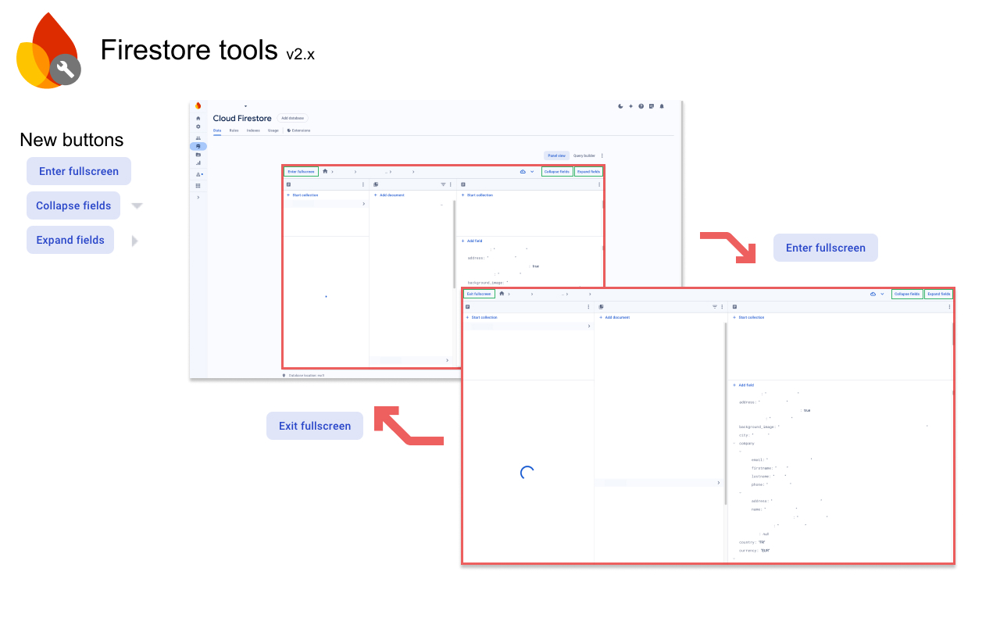

# Firestore tools (Chrome extension)

Simplify your life when using Google Firebase Firestore realtime database browser.

Have you ever spent time browsing the firestore database and wondered why the 3 columns section had to be on such a small screen area? Have you ever spent time clicking on dozens of buttons to collapse the map or array fields of your document?

This extension adds buttons to the interface to solve these problems: fullscreen mode, expand/collapse fields. 

When in fullscreen mode, the 3 columns table takes the whole screen area so that you can browse easily. Click again on the button to exit the fullscreen mode and get back to normal.

No data is read or collected, the extension only adds the button and changes some CSS properties.
Full source code is available here: https://github.com/clementlize/firestore-tools

## Installation

### From the Google Chrome Web Store

Go to the [Chrome Web Store extension page](https://chrome.google.com/webstore/detail/firestore-fullscreen/gemkoopkmgjeegmkoceojgflbpfibnbb) and install it.

### Locally

You can use your own local version of the extension. To do so, follow these steps:

- Clone the project in a dedicated directory on your computer
- Make sure you have NodeJS and npm installed, then run: `npm i`
- Build the project using `npm run start`
- Open the Chrome extensions page (chrome://extensions/)
- Enable the "Developer mode" (top right corner)
- Click on "Load unpacked" (top left corner)
- Open the `dist` directory where you cloned the project

More information here: [Chrome Extension development basics](https://developer.chrome.com/docs/extensions/mv3/getstarted/development-basics/). 

## Roadmap

- [ ] Hide the buttons when editing the document path
- [ ] Settings at the extension level, ex: auto-collapse

## Contribute

Contributions are always welcome! Feel free to open an issue if you want to report a bug or ask for a feature. Don't forget to search for an existing issue before creating one.

If you're a developer and you want to add/edit code, feel free to open a merge request. 

Learn more here: [Finding ways to contribute to open source on GitHub](https://docs.github.com/en/get-started/exploring-projects-on-github/finding-ways-to-contribute-to-open-source-on-github)

## Credits

This project was made using the [chrome-extension-webpack](https://github.com/sszczep/chrome-extension-webpack) boilerplate.

## License

This project is licensed under GNU GPL v3. See the LICENSE file in the repository for more information.